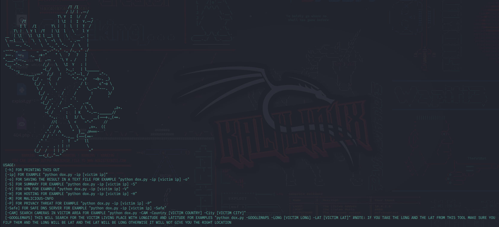

# Doxx 🔎

COLLECT, ANALYZE, AND RUN RECONNAISSANCE.

<p align="center">

</p>

DISCLAIMER: **FOR EDUCATIONAL PURPOSE ONLY! The contributors do not assume any responsibility for the use of this tool.**
Warning: It is advisable to **not** use your own/primary account when using this tool.


## Tools and Commands
```
USAGE: 
 [-h] FOR PRINTING THIS OUT
 [-ip] FOR EXAMPLE "python dox.py -ip [victim ip]"
 [-o] FOR SAVING THE RESULT IN A TEXT FILE FOR EXAMPLE "python dox.py -ip [victim ip] -o"
 [-S] FOR SUMMARY FOR EXAMPLE "python dox.py -ip [victim ip] -S"
 [-V] FOR VPN FOR EXAMPLE "python dox.py -ip [victim ip] -V"
 [-H] FOR HOSTING FOR EXAMPLE "python dox.py -ip [victim ip] -H"
 [-M] FOR MALICIOUS-INFO
 [-P] FOR PRIVACY THREAT FOR EXAMPLE "python dox.py -ip [victim ip] -P"
 [-Safe] FOR SAFE DNS SERVER FOR EXAMPLE "python dox.py -ip [victim ip] -Safe"
 [-CAM] SEARCH CAMERAS IN VICTIM AREA FOR EXAMPLE "python dox.py -CAM -Country [VICTIM COUNTRY] -City [VICTIM CITY]"
 [-GOOGLEMAPS] THIS WILL SEARCH FOR THE VICTIM LIVING PLACE WITH LONGITUDE AND LATITUDE FOR EXAMPLES "python dox.py -GOOGLEMAPS -LONG [VICTIM LONG] -LAT [VICTIM LAT]" #NOTE: IF YOU TAKE THE LONG AND THE LAT FROM THIS TOOL MAKE SURE YOU FILP THEM AND THE LONG WILL BE LAT AND THE LAT WILL BE LONG OTHERWISE IT WILL NOT GIVE YOU THE RIGHT LOCATION
```


## SETUP
1. DOWNLOAD THE TOOL
```
$ git clone https://github.com/HPx12/Doxx/
```
2. GO TO THE DIRECTORY OF THE TOOL
```
$ cd Doxx
```
3. INSTALL REQUIREMENTS
```
$ pip install -r requirements.txt
```
4. Criminal API KEY
   - Go Criminalip.io:  https://www.criminalip.io/en
   - CREATE A ACCOUNT
   - AFTER CREATED A ACCOUNT, CLICK ON YOUR PROFILE PIC UPPER RIGHT
   - CLICK "My Information"
   - YOU WILL SEE API KEY COPY IT
   - AND PASTE IT AFTER RUNNING THIS COMMAND
```
$ bash Setup.sh
```
5. THEN RUN THE TOOL
```
$ python dox.py -h
```
